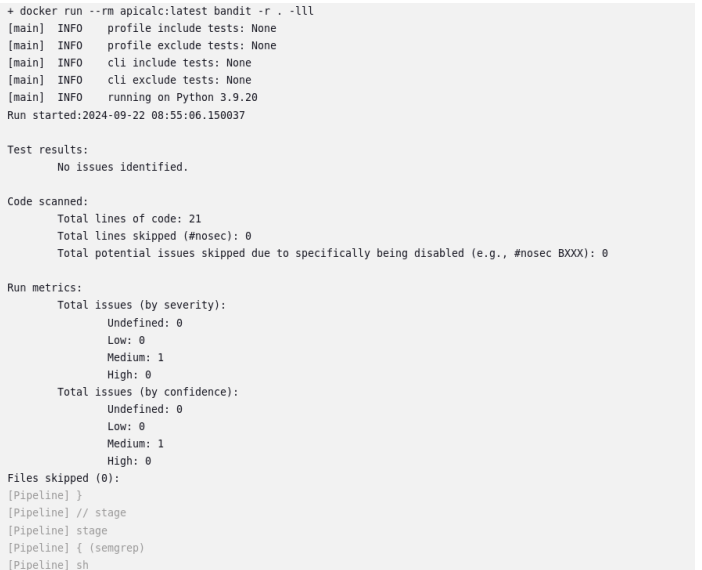
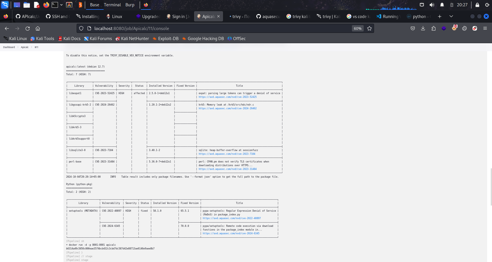
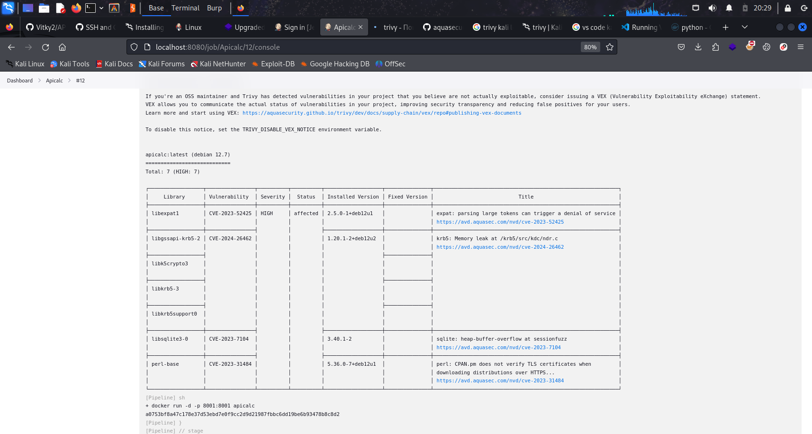

# ДОМАШНЕЕ ЗАДАНИЕ
РИ-411001  
Чулков Виктор Сергеевич  
Черемных Антон Александрович  
Попов Вадим Юрьевич  

## Bandit scan

## Semgerp scan

## trivy scan 1

При первом сканировании были найдены уязвимости в библиотеках проекта и библеиотеках python 3.9 Пропатчив изображения python уязвимости после скана уязвимости не были найдены.

## trivy scan 2

